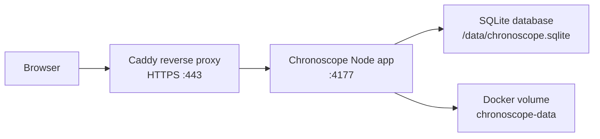

# Chronoscope Deployment

## Architecture



## EC2 Inspection Checklist

Run these commands before changing infrastructure:

```bash
hostnamectl
whoami
uptime
df -h
free -h
sudo ss -tulpn
sudo systemctl --type=service --state=running
docker ps --format 'table {{.Names}}\t{{.Image}}\t{{.Status}}\t{{.Ports}}'
docker compose ls
docker images
docker volume ls
sudo du -h --max-depth=1 /opt /var/www /srv 2>/dev/null | sort -h
```

Record anything bound to ports 80, 443, or 4177 before deploying Chronoscope.

## Cleanup Plan

Only remove resources after confirming they are unrelated to Chronoscope:

1. Label the target Chronoscope deployment directory, Compose project, containers, images, and volumes.
2. Treat unlabeled containers or services as owned by another workload until their command, image, directory, and logs prove otherwise.
3. Stop and remove only exited containers that are not referenced by any active Compose project.
4. Remove dangling images only after checking no stopped container depends on them.
5. Keep all volumes unless their labels or mount paths prove they belong to an obsolete Chronoscope deployment.
6. Keep systemd services unless the unit file path, description, and process command identify an obsolete Chronoscope service.

Useful verification commands:

```bash
docker inspect <container-or-volume>
docker image inspect <image>
systemctl cat <service>
journalctl -u <service> -n 100 --no-pager
```

## Deploy

1. Install Docker Engine and the Compose plugin if they are not already present.
2. Clone the repository into `/opt/chronoscope`.
3. Copy `.env.example` to `.env` and set:
   - `CHRONOSCOPE_DOMAIN`
   - `ACME_EMAIL`
   - `CHRONOSCOPE_API_KEY`
4. Ensure DNS for `CHRONOSCOPE_DOMAIN` points at the EC2 public IP.
5. Start the stack:

```bash
docker compose up -d --build
```

## Operations

```bash
docker compose ps
docker compose logs -f chronoscope
docker compose logs -f caddy
curl -f http://127.0.0.1:4177/healthz
curl -f https://$CHRONOSCOPE_DOMAIN/healthz
```

Replay data persists in the `chronoscope-data` Docker volume as SQLite at `/data/chronoscope.sqlite`.
